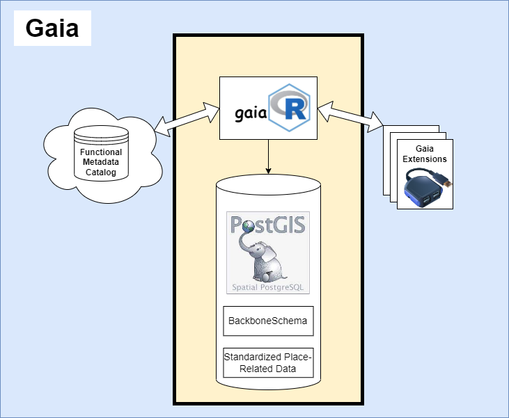

# **Gaia Framework Overview**

</img>

The Gaia Framework provides the highest-level view of the components that compose Gaia; the framework is divided into three main parts, a functional metadata repository (Catalog), staging database and execution engine (Core), and ecosystem of Gaia-compatible software packages (Extensions):

---

 

## [Gaia Catalog](gaia-catalog.html)

A readily-extensible catalog of source datasets. Gaia Catalog contains metadata for public geospatial datasets. Descriptive metadata facilitates search and discovery of relevant datasets. Functional metadata (machine-actionable instructions) enables automated retrieval, extraction, transformation, and loading of public datasets and their constituent variables.

---

 

## [Gaia Core](gaia-core.html)

Gaia Core is the central functionality and storage of Gaia and itself consists of two main features: a **staging database** and an **execution engine**.

The staging database is a PostGIS database with a replica copy of the Gaia Catalog installed in a schema named "backbone". In this database, public datasets that are registered in Gaia Catalog can be "staged": transformed and then loaded as tables in a standardized Entity-Attribute-Value format. Other geospatial data, such as geocoded addresses, can also be loaded into the staging database for use in conjunction with the staged data.

All operations on the staging database (creating tables, inserting data, accessing data, etc.) are performed through the "execution engine". The execution engine can be any software package (e.g. R package, Python library, CLI) that connects to the database and functionalizes the logic required to write or read data to and from the standard format. Currently, there is one execution engine: an R Package named [gaiaCore](gaiaCore/index.html).

---

 

## [Extensions](gaia-extensions.html)

Any functionality that falls outside of Gaia Core's scope (basic Create, Read, Update and Delete operations) can be encapsulated in an Extension. An extension can be thought of as a software package or library that interfaces with Gaia Core (through the execution engine) that collects similar functionality. Extensions can be grouped by the communities they serve or by the functionality they provide. For example, the [gaiaOHDSI extension](gaia-extensions-ohdsi.html) is built to provide members of the OHDSI community useful connectors between Gaia Core and an OMOP database and various OHDSI tools. On the other hand, general (hypothetical) extensions like gaiaVis or gaiaLayer provide visualization and layer building software to Gaia Core, respectively.

