 

> ! **UNDER CONSTRUCTION** !

 

---

# **Preface**

  

## Use Case Simplified

 

To oversimplify, our goal is to create a mechanism to locally deploy a geospatial database, standardize the representation of place-related data within, and automate the process of populating data into it. 

Consequently, the foundational goals of our design can be summarized as:

- Extensibility
  - Tooling (via a standard data model)
  - Collaborative growth
  - Integration with ontologies
- Automation
  - Data retrieval, standardization, ingestion 
  - Deployment of stack 
- Efficiency
  - Storage design
  - Centralized functional metadata

---

 

## Strategy Snapshot

 

| Challenge                                                                                      |                                                                                                                            | Approach                                                                                                                                 |
| :---------------------------------------------------------------------------------------------- | ------------------------- | :---------------------------------------------------------------------------------------------------------------------------------------- |
| Enable extensible tooling                                                                      |                                                                                                                            | Implement a common data model for place-related data                                                                                     |
| Establish universal representation for any place-related data   |                               | Represent data as geometries and attributes (of geometries)                                                                |
| Create efficiency when dealing with large amount of standardized data                  |        | Split each data source into it's own pair of geometries and attributes                                                     |
| Create static functionality that works for any new data added                           |       | Indexing structures and parameterization to treat the collection of disparate tables as if they were functionally combined |
| Maintain source data provenance and versioning                 |              | Data source and variable metadata, given unique identifiers, that are referenced throughout the schema                                   |
| Automate the processes of data retrieval, ingestion, and standardization into our common model | | Create "functional metadata" at both the data source and variable level, and an R package to execute it                    |
| Enable collaborative growth of functional metadata                   |            | Host the metadata centrally, instead of the actual data sources. Create separate tooling to ease burden of creating new metadata records |

---

 

## Pipeline

 

TODO: brief description of the pipline. "GaiaR takes metadata specifications to..." etc. 

 

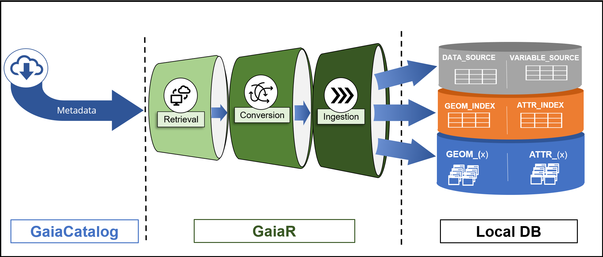
TODO: image descC

 

---

 

# **Backbone Schema** 

 

## Overview

 

There are three distinct portions of our schema:

 

- #### Data Source & Variable Metadata
  - contained within **DATA_SOURCE** and **VARIABLE_SOURCE** tables
    - VARIABLE_SOURCE to DATA_SOURCE is a many-to-one relationship
  - both functional and descriptive metadata

 

- #### Indexing Tables
  - Contained within **GEOM_INDEX** and **ATTR_INDEX**
  - This provides the functional mapping between the data source and variable definitions to the local place-related data
  - These tables are automatically populated when new data sources are added

 

- #### Standardized Place-Related data
  - Contained within **GEOM_*{x}*** and **ATTR_*{x}*** tables (many instances)
  - All place-related data, once ingested, is represented as two tables:
     - Geometries
     - Attributes (of geometries)
  - Each data source is ingested as it's own unique set GEOM and ATTR tables

 

---

 

## *Schema*tics {.tabset .tabset-fade}

 

 
### Conceptual

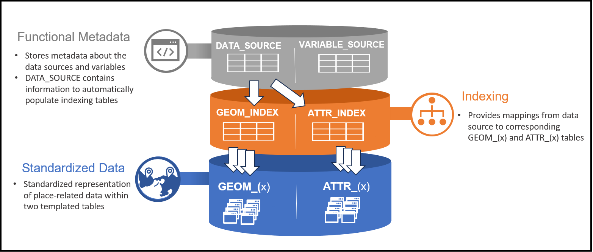

TODO: Summarize diagram

 

---

### Relation Summary

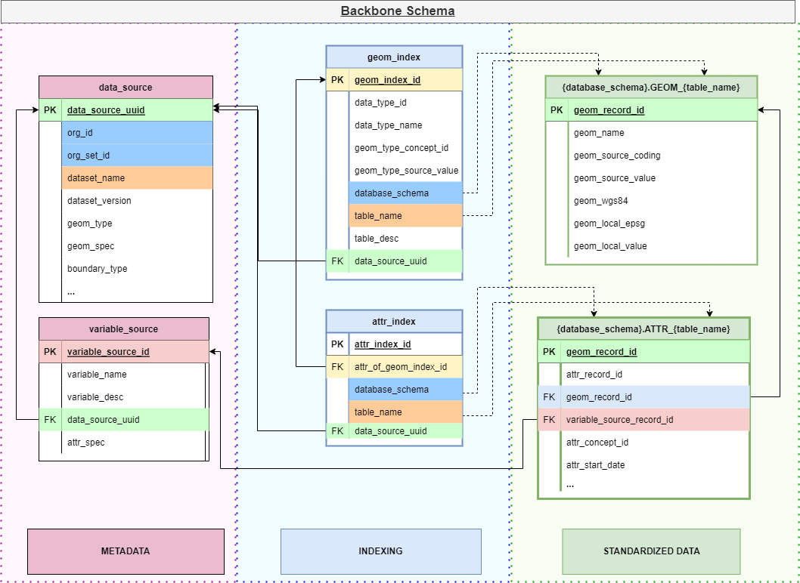

TODO: Summarize diagram

 

---

### Full Schema 

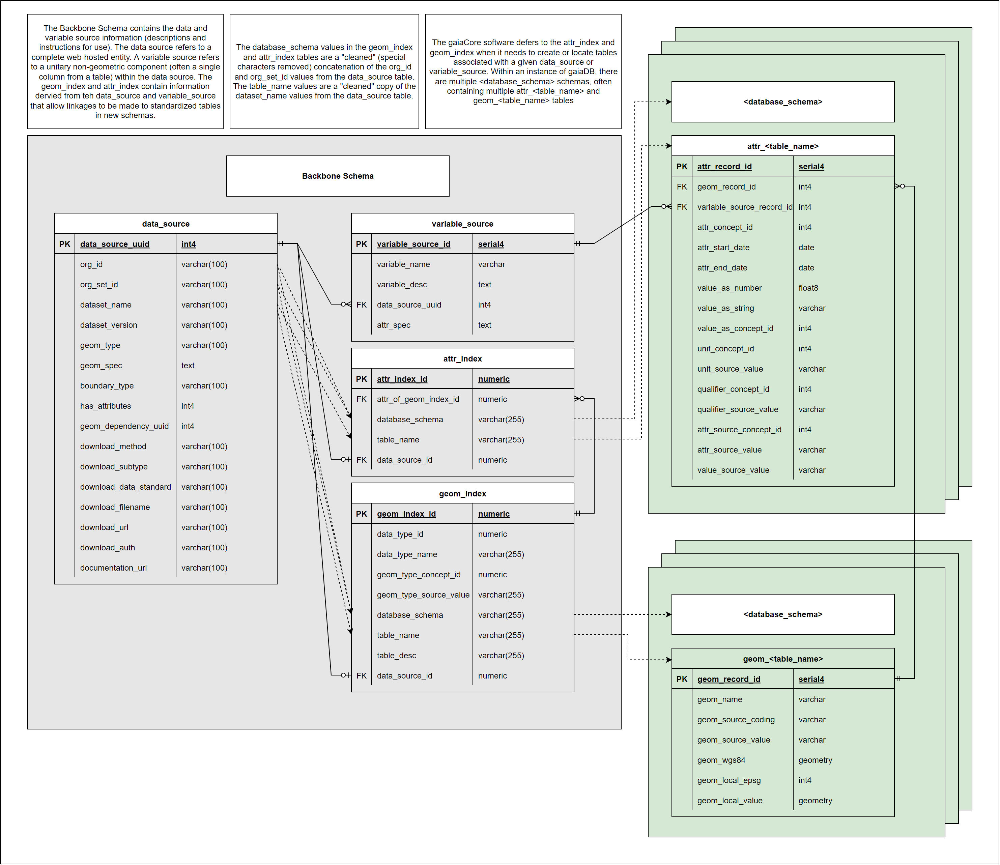

TODO: Summarize diagram

 

---

--- 

// TODO - 1-2 sentence intro

// TODO - Diagram

 

## **Metadata Tables**

There are two tables within the 'Metadata' portion of our schema:

1) [DATA_SOURCE](gaia-principles.html#DATA_SOURCE)
2) [VARIABLE_SOURCE](gaia-principles.html#VARIABLE_SOURCE)

 

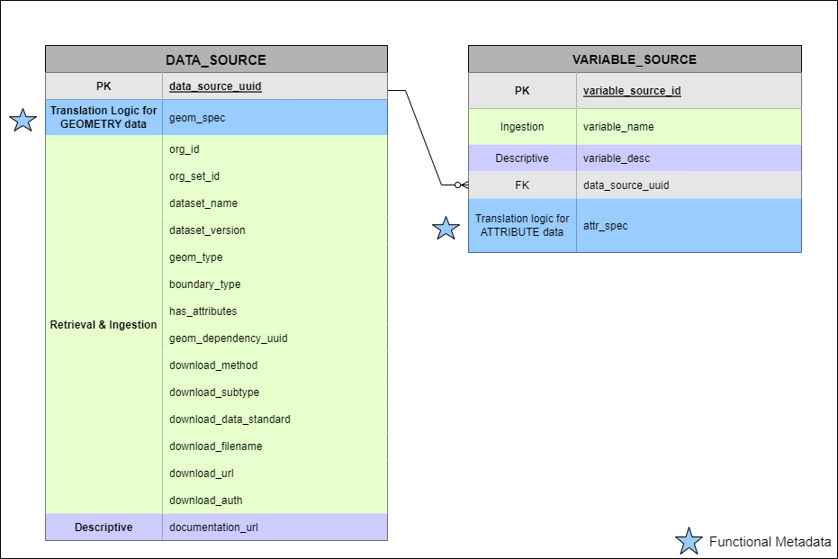

 

> The blue stars signify [functional metadata](gaia-principles.html#Functional_Metadata), described below

---

 

### DATA_SOURCE

 

> For a detailed description see: [Specifications/Backbone/data_source](gaia-datamodels.html#data_source)

- This table contains records that catalog external (or local) web-hosted entities. 
- All source data in gaiaDB must be referenced in this table
- Every record in DATA_SOURCE has it's own UUID
- A DATA_SOURCE record is considered valid when the type of polygon is consistent (e.g. political boundary) and it has a unique combination of {Organization, Organization Set, Dataset Name}
  - If a data source has more than one "granularity" of geometry within (albeit quite rare), we split it up into multiple DATA_SOURCE records accordingly
- This table contains descriptive and functional metadata that is leveraged when:
  - creating the indexing tables
  - downloading and ingesting data sources
  - translating and populating geometry-referenced data into the GEOM_{x} tables
- VARIABLE_SOURCE, GEOM_INDEX and ATTR_INDEX all must persist valid foreign keys to DATA_SOURCE, thus the creation of DATA_SOURCE is the first step of ingestion
- For a given data set, the translation logic for the geometry data is stored within the (DATA_SOURCE).*geom_spec* field. The attributes within a given data source are stored within VARIABLE_SOURCE and the attribute translation logic within (VARIABLE_SOURCE).*attr_spec*

 

---

 

### VARIABLE_SOURCE

 

> For a detailed description see: [Specifications/Backbone/variable_source](gaia-datamodels.html#variable_source)

- The VARIABLE_SOURCE table specifies the identification and translation logic for invidivual variables within a given data source. 
- The relation of VARIABLE_SOURCE to DATA_SOURCE is many-to-one. 
- While DATA_SOURCE contains the functional metadata for translating geometry objects (i.e. DATA_SOURCE.geom_spec), the logic for translating attributes is contained with VARIABLE_SOURCE (i.e. VARIABLE_SOURCE.attr_spec)

 

// TODO: Diagrams

- one (ds) to many (vs)
- example with 1 ds and many vs (svi?)

--- 

  

##  **Indexing tables** </u>

There are two tables within the 'Metadata' portion of our schema:

1. [GEOM_INDEX](gaia-principles.html#GEOM_INDEX)
2. [ATTR_INDEX](gaia-principles.html#ATTR_INDEX)

 

- Both tables are automatically populated by metadata contained within the DATA_SOURCE table. 
- These tables serve as a means to provide functional mapping to standardized place-related data contained in disparate schemas and tables, and, consequently, enables parameterized querying 

 

  

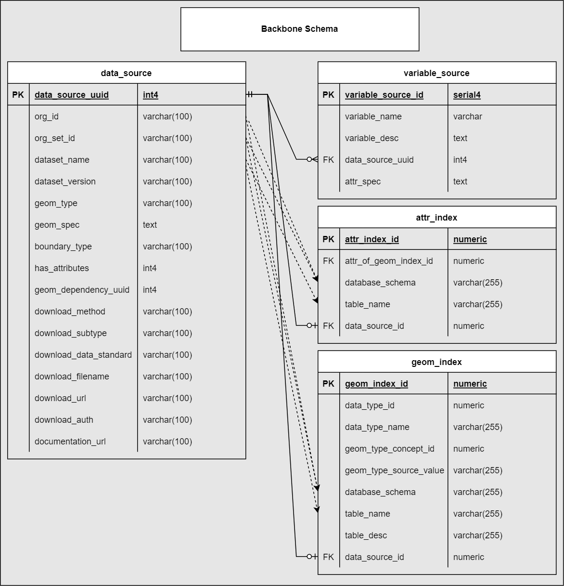

 

### GEOM_INDEX

 

> For a detailed description see: [Specifications/Backbone/geom_index](gaia-datamodels.html#geom_index)

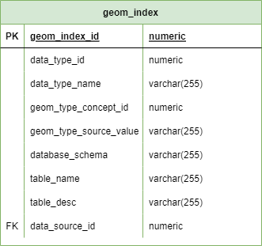
 

--- 

### ATTR_INDEX

 

> For a detailed description see: [Specifications/Backbone/attr_index](gaia-datamodels.html#attr_index)

 

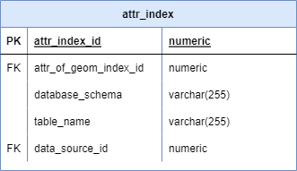

--- 

 

## **Standardized Place-Related Data**

 

### Common Data Model Approach

 

The common data model approach has been a widely adopted solution for clinical data, notably for two specific reasons:

  1. **Interoperability**: Data sources are structured the same but stored separately .If data sets are harmonized then distributed research is enabled
  
  2. **Extensibility**:  If the underlying model is static, it serves as a strong foundation to develop stable tooling, and community growth, on top of it
  
 
  
- While interoperability and opening the doors for federated research are positives, the main reason for adoption of such an approach is to **enable extensibility in tooling, application, and scaling of data sources**. 
- In the simplest description, our "common data model" can be though of as **geometry objects with affiliated temporal attributes**
- The most significant restructuring that occurs is translating attributes to be represented in a format that is (close to) an **Entity, Attribute, Value (EAV) structure**. While many if not most place-related data sets are represented as "wide" tables, with variance in column naming and structure, we convert these "wide" tables into "EAV" table - similar to a "transpose" function. In doing so, we allow a single standard representation, with static columns, for all attributes and geometries. 

---

 

### GEOMETRY and ATTRIBUTE

 

- There are two template tables that are used to replicate the same two tables for every data source. 
  - GEOM_TEPLATE & ATTR_TEMPLATE
- The schema and table names are:
  - Determined by fields in the respective row of the DATA_SOURCE table
  - Persisted as mapping within the indexing tables

 

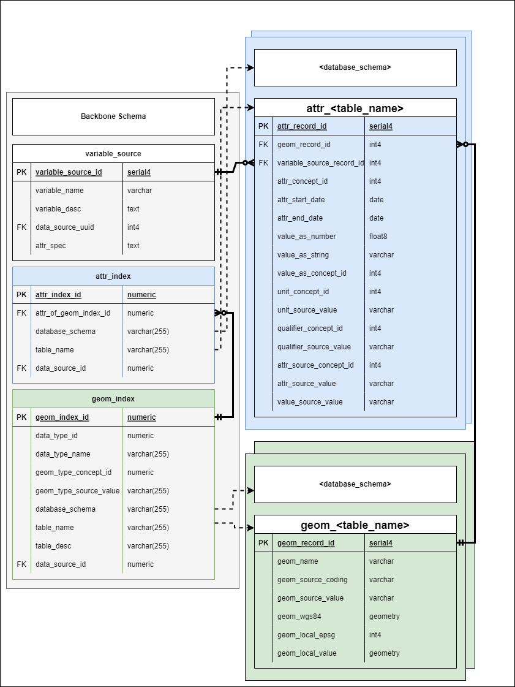

  

#### GEOM_TEMPLATE

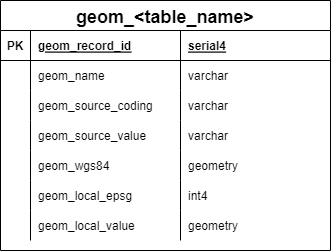

--- 

#### ATTR_TEMPLATE

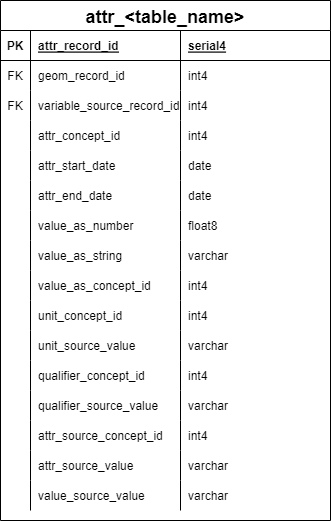

  

---

# **Functional Metadata**

 

TODO: purpose/use, etc.

- defined structure

- "recipes"

- Centralized Repository 
  - one paragraph and a link to GaiaCatalog

 

## *geom_spec* 

// TODO: description 

 

## *attr_spec*

// TODO: description 

 

